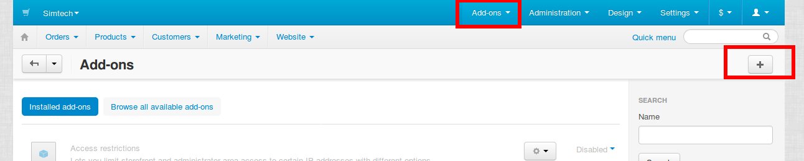
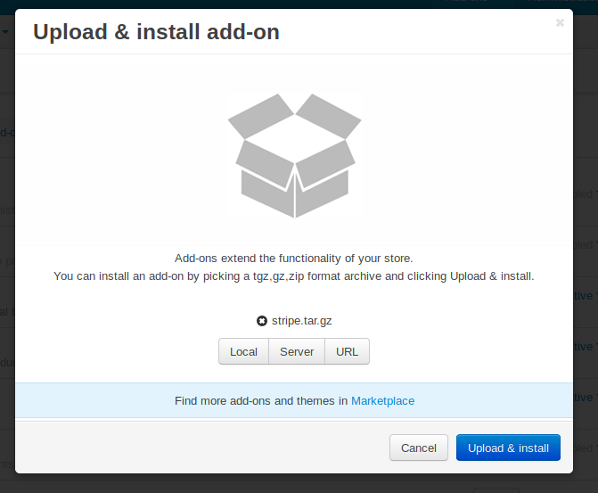
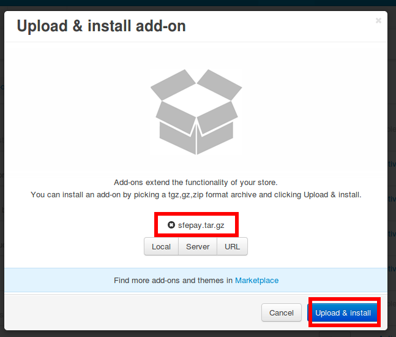
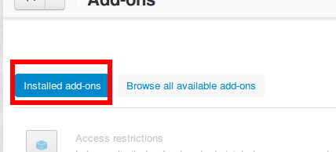
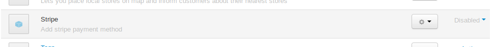
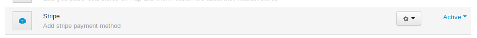
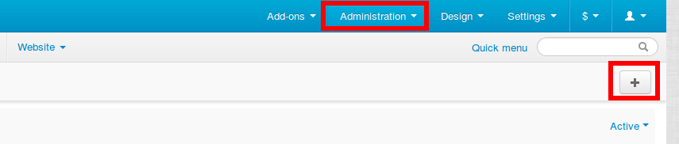
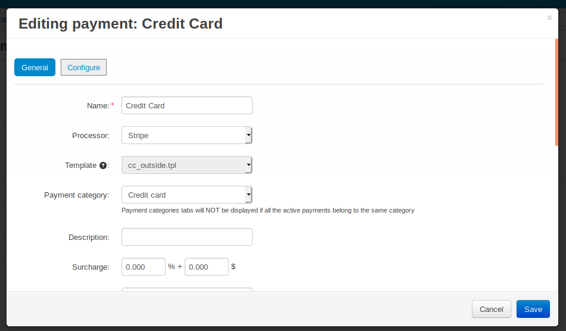
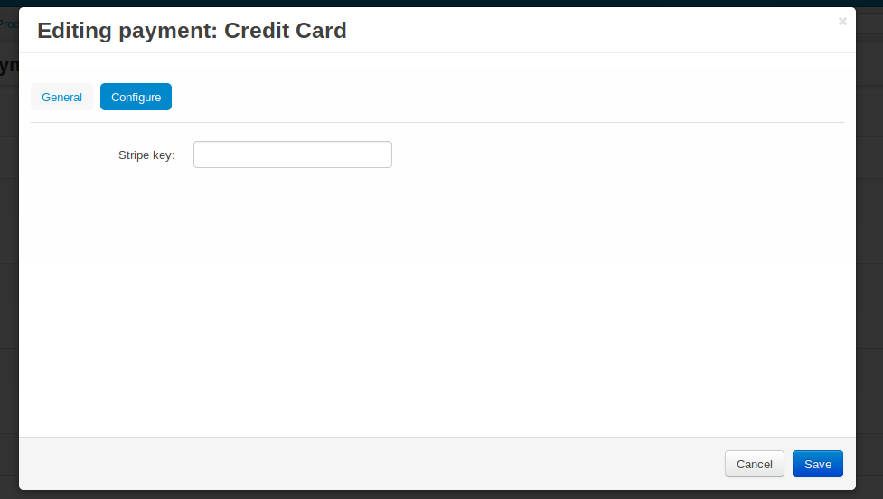
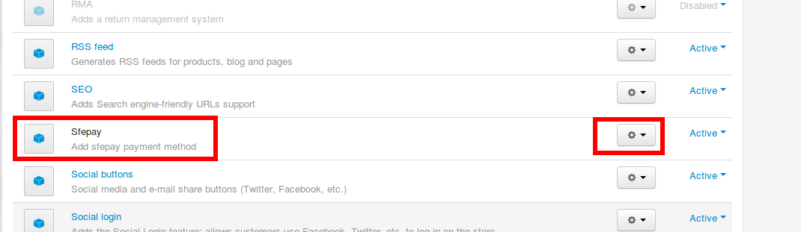

# cscart-payment-stripe
* stripe支付cscart插件使用说明
* 适用与Cs-cart 4.3.2，其他版本并未测试

## 安装方法
* Add-ons -> Manage add-ons -> 点击+

* Local -> 选择stripe.tar.gz压缩包 -> 点击Upload & Install

* Add-ons -> Manage add-ons -> Installed add-ons -> stripe -> 点击Active

* 找到Stripe插件，点击右侧的Active

* 点击后Stripe插件为启用状态，完成安装

## 配置方法
* Administration -> Payment methods -> 点击+

* 按照图中数据填好

* 点击configure选项卡
* 填入Key，然后点击创建

## 卸载方法
* Add-ons -> Manage add-ons -> stripe -> Uninstall

## Trouble Shooting

### 安装后checkout无法显示填写卡号信息等的页面，提示找不到cc_stripe.tpl文件
* 问题原因
    * 由于stripe插件使用了自定义模板，安装位置设定于默认目录，如果用户安装了其他主题，则该主题不会包含自定义模板，报错显示找不到该模板文件。
* 解决方案
    * 确认问题
        1. 了解当前使用的网站theme名称
        1. 到`/design/themes/[你使用的theme名称]/templates/views/orders/components/payments`下确认是否有cc_stripe.tpl文件，如果没有，则证明属于该问题，可以使用下面方法解决。
    * 解决步骤
        1. `cd /design/themes/[你使用的theme名称]/templates/views/orders/components/payments`
        1. `cp /design/themes/responsive/templates/views/orders/components/payments/cc_stripe.tpl .`
        1. `chown www:www cc_stripe.tpl`
